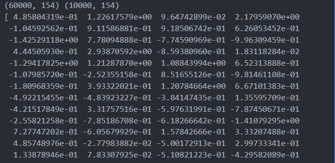
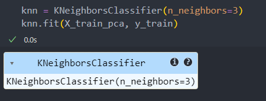
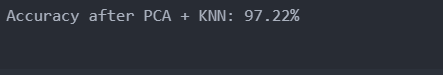

# PCA-Enhanced-KNN-for-Handwritten-Digit-Recognition
This project demonstrates handwritten digit classification using the **MNIST dataset**. It applies **PCA** to reduce the dimensionality of 784 features while preserving 95% of the variance. A **K-Nearest Neighbors (KNN)** classifier is then trained on the reduced data. The goal is to improve computational efficiency while maintaining high accuracy.    
## Step 1: Import necessary libraries    
```
from tensorflow.keras.datasets import mnist
from sklearn.decomposition import PCA
from sklearn.neighbors import KNeighborsClassifier
from sklearn.metrics import accuracy_score
import numpy as np
```
## Step 2: Load the MNIST dataset  
- Loads 60,000 training images and 10,000 test images.   
- Each image has shape (28, 28) and is a grayscale digit from 0 to 9.    
```
(X_train, y_train), (X_test, y_test) = mnist.load_data()
```
## Step 3: Flatten the 2D images into 1D feature vectors and normalize them    
- reshape(-1, 28*28): transforms each 2D image into a flat 1D array (784 pixels).
- / 255.0: normalizes pixel values to range [0, 1] for better model performance.
```
X_train_flat = X_train.reshape(-1, 28*28).astype('float32') / 255.0
X_test_flat = X_test.reshape(-1, 28*28).astype('float32') / 255.0
print(X_train_flat.shape, X_test_flat.shape)
```
<p align="center">
      
</p>      

## step 4: Apply PCA   
**PCA** reforms the dataset by identifying and removing redundancy between variables — especially those that are highly correlated. It keeps the most important patterns (variability) and eliminates the less useful or repeated information, effectively reducing the number of features while preserving as much of the data’s structure as possible.         
In this case :       
- PCA reduces the number of features from 784 to fewer (like ~150) while keeping 95% of variance.
- This reduces computation time and can improve generalization.
```
pca = PCA(0.95)
X_train_pca = pca.fit_transform(X_train_flat)
X_test_pca = pca.transform(X_test_flat)
print(X_train_pca.shape, X_test_pca.shape)
print(X_train_pca[0])
```
<p align="center">
      
</p>      
     
## Step 5: Train the KNN classifier (k = 3)   
- KNN stores all training data and classifies based on the 3 closest samples (neighbors).
- Uses Euclidean distance by default.
- No training happens in the traditional sense; the model simply memorizes the data.
```
knn = KNeighborsClassifier(n_neighbors=3)
knn.fit(X_train_pca, y_train)
```
<p align="center">
      
</p>   
     
## Step 6: Make predictions and evaluate model accuracy    
```
y_pred = knn.predict(X_test_pca)
accuracy = accuracy_score(y_test, y_pred)
print(f"Accuracy after PCA + KNN: {accuracy * 100:.2f}%")
```
<p align="center">
      
</p>  
  
## PCA Function:     
```
def my_pca(X, n_components):
    X_meaned = X - np.mean(X, axis=0)
    cov_matrix = np.cov(X_meaned, rowvar=False)
    eigenvalues, eigenvectors = np.linalg.eigh(cov_matrix)
    sorted_idx = np.argsort(eigenvalues)[::-1]
    sorted_eigenvalues = eigenvalues[sorted_idx]
    sorted_eigenvectors = eigenvectors[:, sorted_idx]
    components = sorted_eigenvectors[:, :n_components]
    explained_variance = sorted_eigenvalues[:n_components]
    X_reduced = np.dot(X_meaned, components)
    return X_reduced, components, explained_variance
```
## KNN Function:
The **KNN** classification method used in this project is based on a reusable function already implemented in a previous work. For detailed implementation and explanation,         
please refer to [this related project](https://github.com/BenOthmenRayen/Digit-Classification-using-Hu-Moments-and-K-Nearest-Neighbors-on-the-MNIST-Dataset/blob/main/README.md).         


